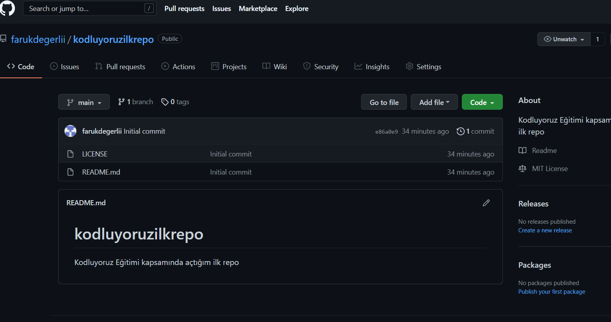

# Kodluyoruz Ilk Repo
bu repo [Kodluyoruz](https://www.kodluyoruz.org/) Front-End egitiminde 
olusturdugumuz ilk repo. Icerisinde bir adet README dosyası bir adet de index.html barındırıyor.

## Installation
Öncelikle projeyi clonelayalım (Buraya sizin reponuzdan attığınız link gelecek)

'git clone https://github.com/farukdegerlii/kodluyoruzilkrepo.git

## Usage
Projeyi klonladıktan sonra Visual Studio Code'da açınız.
Linux için:

'''
cd kodluyoruzilkrepo
code .
'''

## Contributing
Pull requestler kabul edilir. Büyük değişiklikler için, lütfen önce neyi değiştirmek istediğinizi tartışmak için bir konu yazınız.

## Licence
[MIT](https://opensource.org/licenses/MIT)